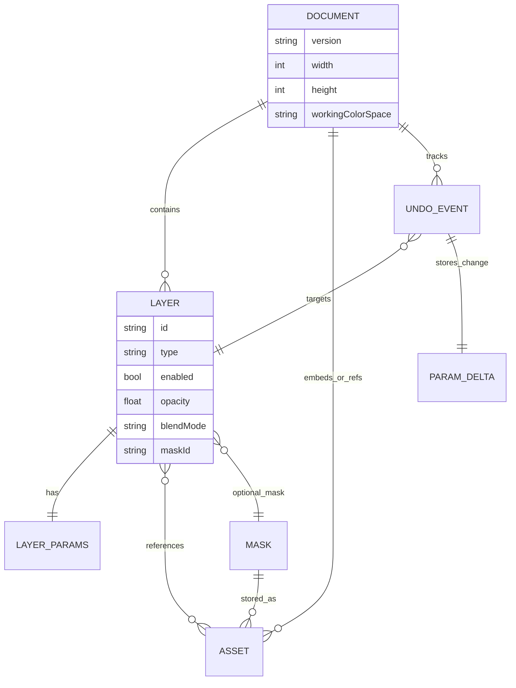

# Deep research report: improving two existing layer ideas and adding high‑quality layer types

## Executive summary
This report upgrades the two existing layer ideas into implementation-ready designs: a physically grounded Bokeh Blur (polygonal aperture PSF with optional depth/CoC map, specular highlight controls, deterministic blue-noise jitter, and robust compositing) and an Anisotropic Diffusion layer (Perona–Malik with stable iteration controls plus an optional coherence-enhancing diffusion-tensor mode driven by a structure tensor). (Perona–Malik 1990). citeturn1search0

It also proposes six additional high-quality layer types aligned with non-destructive workflows shown by major editors (e.g., filter masks/layers) and standardized compositing/blending math:
Curves (1D LUT), Color Lookup (3D LUT), Displacement Warp, Poisson Clone/Heal (gradient-domain), Richardson–Lucy Deconvolution Sharpen, and Local Laplacian Tone/Detail. (Krita filter masks; Photoshop Curves and Color Lookup; Poisson editing; local Laplacian filtering). citeturn13view0turn7search0turn7search2turn6search1turn6search0

Quality-over-performance is explicitly assumed: multiple full-resolution float render targets, high iteration counts, large sample kernels, and multi-pass pyramids are acceptable; designs prefer correctness, precision, and stability even if computationally heavy. (Floating-point render targets via EXT_color_buffer_float; WebGL 2 baseline). citeturn4search4turn4search2

## Scope and assumptions
Assumption: the editor is a registry-driven layer stack renderer where each layer consumes an input image (the current composite) and produces an output image, with optional masking, opacity, and blend mode per layer (common in layer-based compositors). This assumption is used because the provided layer idea text is partially elided, and exact engine contracts are not fully specified.

Assumption: internal processing is linear-light RGB with alpha, and output is later gamma-encoded for display; internal buffers may hold HDR values > 1.0 (needed for physically plausible bloom/bokeh and for reducing banding in iterative PDE/image-restoration passes). (Compositing/blending specs define math independent of encoding but require consistent interpretation; float formats enable HDR). citeturn10view3turn4search4

Assumption: WebGL2 (or equivalent GPU API) is available; high-quality paths use floating-point renderable textures. In WebGL, rendering to RGBA16F/RGBA32F requires EXT_color_buffer_float (and/or related float/half-float extensions depending on targets). citeturn4search4turn4search12

Design goal alignment with established UX: non-destructive “filter mask/layer” style workflows are expected (edit parameters later, mask the effect, reorder layers). Krita explicitly describes filter masks as non-destructive, editable later, and paintable as a mask. citeturn13view0

## Core math, compositing, and architectural primitives
Color model and blending baseline
Use Porter–Duff “source over” compositing (the common layer compositing operator) as the default. (Porter–Duff 1984; W3C Compositing & Blending Level 1). citeturn0search1turn10view0

Notation per pixel (linear-light):
Backdrop (already composited below current layer): Cb (non-premult RGB), αb
Layer result before compositing: Cs (non-premult RGB), αs
Premultiplied: c = α * C

W3C simple alpha compositing (premultiplied form):
co = Cs * αs + Cb * αb * (1 − αs); αo = αs + αb * (1 − αs). citeturn10view3

Blend modes
Define a per-channel blending function B(Cb, Cs) (multiply/screen/overlay/etc.) and apply it as the W3C model describes: blending produces a modified source color which is then Porter–Duff composited. W3C provides explicit formulas for many blend modes (e.g., multiply, screen, hard-light, soft-light). citeturn9view0turn10view2

Recommended implementation rule (robust, matches W3C algebra):
1) Convert to non-premult for blending:
Cb_np = (αb > 0) ? cb_premult / αb : 0
Cs_np = (αs > 0) ? cs_premult / αs : 0
2) Compute blended source color (non-premult): Cblend = B(Cb_np, Cs_np)
3) Apply opacity and mask: αs’ = clamp01(αs * layerOpacity * mask)
4) Composite (premult):
cs’_premult = αs’ * Cblend
co_premult = cs’_premult + cb_premult * (1 − αs’)
αo = αs’ + αb * (1 − αs’)
This is consistent with the W3C “blend then composite” framing and its source-over equations. citeturn10view0turn10view2

GPU precision and render-target requirements
Iterative filters (anisotropic diffusion, Poisson solve, deconvolution) are sensitive to quantization and rounding; prefer RGBA16F at minimum, optionally RGBA32F for very long iteration counts or high dynamic range. EXT_color_buffer_float makes RGBA16F/RGBA32F color-renderable in WebGL. citeturn4search4turn4search0
Half precision has limited mantissa and range; it can be adequate for many image ops but may accumulate error in long iterative solvers; treat RGBA32F as “quality mode.” (IEEE float16 characteristics). citeturn4search3

Common layer object model (proposed)
LayerBase fields (shared across all types)
id (stable UUID string); type (string); enabled (bool)
opacity (0..1); blendMode (enum; default normal); isolateGroup (bool; optional)
maskRef (optional resource id); maskMode (luma/alpha; linearMask bool)
params (type-specific struct); uiState (collapsed, lastPanelTab, etc; not serialized if desired)

Resource references (for LUTs, maps, noise textures)
Asset manager keyed by content hash; layers reference assetId only; undo/redo switches assetId and refcounts assets; large binary is not duplicated per history event (quality-first but memory-safe).

Undo/redo model (proposed)
Command objects store: target layer id; param path; oldValue; newValue; optional oldAssetId/newAssetId; mergeKey for scrubby sliders.
Do not store intermediate render textures in history; treat render caches as derived and invalidatable.

Mermaid: rendering pipeline flowchart
```mermaid
flowchart TD
  A[Load source image] --> B[Convert/confirm working space linear RGBA]
  B --> C[Allocate/resize render targets (float where available)]
  C --> D[Input = source composite]
  D --> E{For each layer in stack}
  E -->|enabled| F[Layer apply: run shader/pass graph -> layerResult]
  F --> G[Composite: blend mode + opacity + mask -> newComposite]
  G --> E
  E -->|done| H[Final output stage: dither + gamma/encode for display/export]
  H --> I[Preview + export]
```

Mermaid: layer data model ER chart


## Improved specifications for the two existing layer ideas
Existing idea A: Bokeh Blur (physical lens simulation)
Reference behaviors in major tools
Photoshop’s Lens Blur exposes depth map selection, iris shape with radius/blade curvature/rotation, specular highlight threshold/brightness, and noise. citeturn12view0
GIMP’s Lens Blur includes an auxiliary input for blur computation, radius, highlight factor/threshold, and clip-to-input extents. citeturn11view0

Concise critique of the current idea (based on partially elided spec; missing details treated as unspecified)
Underspecified kernel normalization: a “highlight-weighted” accumulation (e.g., power curve) can violate energy conservation and shift global exposure unless explicitly normalized per pixel and separated from artistic highlight boosting (a common pitfall in “bokeh coin” implementations).
Underspecified alpha handling: if sampling ignores premultiplication and matte edges, bright fringes and haloing may appear when blurring cutouts; correct handling requires premultiplied alpha-aware convolution or explicit edge dilation.
Artifact controls (onion rings, cat’s eye) need deterministic parameterization and documented interaction with sampling jitter; otherwise results vary non-reproducibly under undo/redo and produce temporal shimmer if animated.
No explicit mention of depth/CoC map input, yet mainstream “lens blur” UX includes it; adding it yields a strictly more powerful layer and matches user expectations. citeturn12view0turn11view0

Improved design specification (quality-first)
Layer semantics
Type: "bokehBlur"
Acts as a filter layer: takes current composite as input; outputs blurred image; then composites per blendMode/opacity/mask.
Optional CoC map (depth map) support: per-pixel blur radius = baseRadiusPx * cocScale * coc(uv) + cocBias; coc read from a selectable source (mask, alpha, another layer/channel asset). (Matches Photoshop “Depth Map” and GIMP “Aux input” patterns). citeturn12view0turn11view0

Kernel / PSF model
Aperture shape: N-blade polygon with blade curvature and rotation (to match Photoshop’s “Iris” controls). citeturn12view0
Edge softness: smoothstep transition at aperture boundary (anti-alias, avoids harsh “stenciled” bokeh).
Cat’s-eye (mechanical vignetting) approximation: toward image edges, compress aperture along radial direction and optionally clip against a “vignette window” to simulate off-axis truncation; parameterize with strength and falloff.
Onion rings: radial modulation of PSF weight; implement as optional multiplicative term w *= 1 + onionIntensity * sin(2π * rings * r + phase) with r in [0,1]; clamp to non-negative to avoid negative lobes.

Highlight model (separate physical vs artistic)
Two modes:
Physical convolution (recommended default): linear convolution with normalized kernel; preserves average energy in linear RGB.
Specular boost (optional): apply a thresholded gain to samples above a luma threshold, similar in spirit to specular highlight controls in Photoshop and GIMP. (Photoshop: threshold/brightness; GIMP: highlight factor/threshold). citeturn12view0turn11view0
Implementation detail: compute two accumulations:
accBase = Σ w_i * sample_i
accSpec = Σ w_i * sample_i * specGain(sampleLuma)
Then output = normalize(accBase) + specularStrength * normalize(accSpec − accBase) to keep exposure stable while still “popping” highlights.

Sampling strategy (quality-first, robust)
Use a low-discrepancy disk distribution (e.g., Vogel/golden-angle spiral) plus deterministic blue-noise jitter per pixel to transform banding into fine grain; jitter must be seeded by (layerSeed, pixelCoord) so undo/redo and re-render are deterministic.
Sample count up to 256 taps is explicitly allowed; expose it as a quality parameter.
For CoC map: sample positions scale with local radius; do not reduce tap count near small radii (keeps small blur smooth), but clamp radius = 0 fast path.

Data structures (CPU-side and GPU-side)
Params struct (recommended; defaults in parentheses)
baseRadiusPx (12.0)
useCocMap (false); cocMapRef (null); cocScale (1.0); cocBias (0.0)
blades (6); bladeCurvature (0.0); rotationRad (0.0)
edgeSoftness (0.15)
sampleCount (128); jitterStrength (1.0); seed (uint32)
highlightMode ("physical+spec"); highlightThreshold (1.0 in linear luma); highlightBrightness (0.5); highlightSoftKnee (0.2)
catEyeStrength (0.0); catEyeFalloff (2.0)
onionIntensity (0.0); onionRings (8)
chromaticFringePx (0.0) (optional; separate per-channel radii)
borderMode ("clamp" | "mirror" | "wrap" | "transparent") (clamp)

GPU resources
kernelSamplesTex: RG16F 1×N storing unit-disk offsets; optionally BA stores per-sample base weight
blueNoiseTex: fixed tile, e.g., 128×128 R8 or RG8
tempRGBA16F ping-pong buffers for internal passes (only 1 pass needed for uniform blur; CoC blur still single-pass but heavier)

Rendering pipeline steps (per render)
1) Validate float render targets; allocate output tex (RGBA16F or RGBA32F quality mode). (EXT_color_buffer_float). citeturn4search4
2) Ensure kernelSamplesTex is in sync when sampleCount changes.
3) For each pixel:
3a) radiusPx = baseRadiusPx if no CoC map else baseRadiusPx * cocScale * coc + cocBias (clamp ≥ 0).
3b) Gather samples: uv_i = uv + offset_i * radiusPx / resolution; apply cat-eye transform to offset_i if enabled.
3c) Sample input with chosen borderMode; accumulate as described (base + optional spec).
3d) Normalize by Σ w_i (and separately for spec accumulator).
4) Composite blurred output over input using blendMode/opacity/mask using the core compositing math above. (Porter–Duff; W3C blending). citeturn0search1turn10view3turn10view2

API surface (suggested; JS/TS style)
createBokehBlurLayer(params?: Partial<BokehBlurParams>) -> LayerId
setLayerParams(layerId, patch) (supports scrubby updates; merges into undo group)
setLayerAssetRef(layerId, field, assetId|null) (CoC map, noise)
renderLayer(ctx, layerId, inputTex, outputTex, cachePolicy)
getCostEstimate(layerId, resolution) -> { taps, passes, bytes, msHint }
serializeLayer(layerId) -> JSON
deserializeLayer(json) -> layerId

State/serialization format (versioned; compact)
```json
{
  "id": "L_bokeh_01",
  "type": "bokehBlur",
  "v": 1,
  "enabled": true,
  "opacity": 1.0,
  "blendMode": "normal",
  "maskRef": null,
  "params": {
    "baseRadiusPx": 12.0,
    "useCocMap": false,
    "cocMapRef": null,
    "blades": 6,
    "bladeCurvature": 0.0,
    "rotationRad": 0.0,
    "sampleCount": 128,
    "seed": 1337
  }
}
```

Undo/redo considerations
Parameter scrubbing (radius, threshold, brightness, blades): merge into a single undo event per continuous gesture; store old/new primitive values.
Changing sampleCount or enabling CoC map should invalidate render caches; cache invalidation is not an undo event.
Assets (CoC map ref, blue-noise selection): undo stores previous assetId; resource manager refcounts and frees GPU textures when no longer referenced.

Compositing math notes specific to this layer
Prefer operating on premultiplied alpha to avoid matte halos when blurring cutouts; blur should convolve premultiplied RGB and alpha consistently, then un-premultiply only if required by downstream blend math.
If blending is performed in non-premult space, ensure safe un-premultiply with epsilon to avoid NaNs when α≈0. (W3C premultiplied definitions and source-over forms). citeturn10view3

GPU/CPU implementation notes
WebGL loop limits: implement MAX_TAPS compile-time constant; early-exit by weight=0 for taps above sampleCount.
Float blending: if compositing is done as another shader pass rather than fixed-function blending, you avoid needing float blending extensions; this is often simpler and more deterministic for complex blend modes.
If EXT_color_buffer_float is unavailable, provide an 8-bit fallback but expect visible banding/noise in highlights; quality-first mode should warn and/or require float targets. citeturn4search4

Edge cases and correctness traps
Radius=0: exact passthrough (no sampling).
Very large radius: border behavior dominates; if borderMode=transparent, edges darken; if clamp, edges smear; expose border modes clearly.
HDR highlights: highlightThreshold must be defined in linear luma, not sRGB; otherwise behavior varies with encoding.
Alpha holes: ensure sample weights don’t introduce color where alpha is near zero; premult blur prevents “color bleeding with zero alpha.”

Existing idea B: Anisotropic Diffusion (Perona–Malik PDE filter)
Reference foundation
Perona–Malik defines anisotropic diffusion as a nonlinear diffusion process with an edge-stopping conduction function depending on gradient magnitude, intended to smooth within regions while preserving edges. citeturn1search0turn1search11
Weickert’s work extends diffusion with diffusion tensors derived from structure tensors for coherence-enhancing diffusion that smooths along structures. citeturn1search1turn1search23

Concise critique of the current idea (based on partially elided spec; missing details treated as unspecified)
Color handling is underspecified: independently diffusing RGB channels can create hue shifts; vector-valued diffusion or diffusion driven by a common structure tensor is safer for color images (Weickert provides tensor-based color diffusion variants). citeturn1search23turn1search1
Numerical scheme is underspecified: explicit schemes have stability conditions; a fixed “λ ≤ 0.25” is only correct for specific discretizations; the layer should expose dt with guarded clamps and optionally provide an unconditionally stable scheme (AOS / semi-implicit) for “quality at high iterations.” (Weickert’s book discusses discrete settings; numerical stability is a primary concern). citeturn1search1turn1search10
Gradient operator choice (Sobel/Scharr) is mentioned but not parameterized; Scharr is often preferred for rotational symmetry in small kernels; expose as an option when quality is prioritized.

Improved design specification (two-tier: Perona–Malik + coherence-enhancing)
Layer semantics
Type: "anisotropicDiffusion"
Filter layer: takes current composite, outputs diffused image; composites per blendMode/opacity/mask.

Modes
Mode 1 Perona–Malik scalar conduction (classic)
Compute gradient magnitude |∇I|; pick conduction function c(|∇I|) with the Perona–Malik forms:
c1 = exp(−(|∇I|/K)^2) or c2 = 1 / (1 + (|∇I|/K)^2). citeturn1search0
Use explicit iterative update.

Mode 2 Coherence-enhancing diffusion (tensor mode; high-end)
Compute structure tensor J (smoothed outer product of gradients), get eigenvectors (v1 along structures, v2 across), build diffusion tensor D = λ1 v1 v1^T + λ2 v2 v2^T with λ1 > λ2 to smooth primarily along v1; this is the core idea in coherence-enhancing diffusion. citeturn1search23turn1search1

Color strategy (recommended)
Compute gradients on luma (or on vector gradient magnitude), but update RGB together using the same conduction/tensor field to reduce chroma artifacts. (Weickert’s vector-valued diffusion for colour images). citeturn1search23turn1search13

Discretization and stability (explicit, quality-first safeguards)
Discrete grid: 4-neighbor or 8-neighbor; prefer 4-neighbor for simpler stability bounds.
Expose dt (time step) and clamp it based on neighbor stencil; provide safe defaults.
If offering a “fast converge” option, implement semi-implicit/AOS; Weickert’s text treats semi-discrete and fully discrete settings and is a standard reference for nonlinear diffusion filtering. citeturn1search1

Data structures
Params struct (recommended; defaults in parentheses)
mode ("peronaMalik")
iterations (20)
dt (0.15) (auto-clamped)
edgeThresholdK (0.08 in normalized luma units; or scale by image stats)
conduction ("exp" | "reciprocal") ("exp")
gradientOperator ("scharr" | "sobel") ("scharr")
tensorSigma (1.0) smoothing for gradients (tensor mode)
integrationSigma (2.0) smoothing for structure tensor (tensor mode)
coherenceStrength (0.8) (tensor mode)
preserveMean (false) (optional: keep global average color consistent)

GPU resources
Two ping-pong float textures for the evolving image (RGBA16F/32F).
For tensor mode: additional RG16F textures for gradient, and RGBA16F for tensor components (Jxx, Jxy, Jyy, unused) per pixel, plus temporary buffers for smoothing.

Rendering pipeline steps
1) Allocate ping-pong buffers in floating point. (EXT_color_buffer_float). citeturn4search4
2) Initialize state0 = input image (premultiplied recommended).
3) For i in 1..iterations:
3a) Compute gradients from state (Scharr/Sobel).
3b) Compute conduction c(|∇I|) (Perona–Malik) or compute tensor D (structure tensor → eigenvectors/values → diffusion tensor). citeturn1search0turn1search23
3c) Update: stateNext = state + dt * div( c * ∇state ) (scalar) or stateNext = state + dt * div( D ∇state ) (tensor). citeturn1search0turn1search1
4) Composite final state over input with blendMode/opacity/mask using the core compositing model. citeturn10view3turn10view2

API surface (suggested)
createAnisotropicDiffusionLayer(params?) -> id
setParams(id, patch) (gesture-merge undo)
renderLayer(ctx, id, inputTex, outputTex, cachePolicy)
precomputeTensorField(ctx, id, inputTex) (optional cache for tensor mode)
serialize/deserialize as in the shared model

State/serialization format
```json
{
  "id": "L_adiff_01",
  "type": "anisotropicDiffusion",
  "v": 1,
  "enabled": true,
  "opacity": 1.0,
  "blendMode": "normal",
  "maskRef": null,
  "params": {
    "mode": "peronaMalik",
    "iterations": 20,
    "dt": 0.15,
    "edgeThresholdK": 0.08,
    "conduction": "exp",
    "gradientOperator": "scharr"
  }
}
```

Undo/redo considerations
Iterations and dt are the highest-impact parameters; scrubbing them should merge into a single undo entry.
Tensor mode toggles allocate/free extra buffers; treat allocation as derived cache behavior, not undo state.
If using stochastic elements (not recommended here), store seed; otherwise diffusion should be deterministic given inputs.

Compositing math notes specific to this layer
Diffusion should operate on premultiplied RGB and alpha separately if alpha is meaningful; alternatively, diffuse only RGB and pass alpha through unchanged if the layer semantics are “surface smoothing” rather than matte modification. State this explicitly in UI; both are valid but produce different results.

GPU/CPU notes
Per-iteration cost is high; quality-first can still provide progressive preview: render N_preview iterations while dragging, then refine to N_final on release (optional; not required by this spec).
CPU/worker fallback is possible but will be slow for large images; GPU multi-pass ping-pong is the intended path.

Edge cases
dt too large: causes oscillation/edge ringing; clamp and warn (stability concerns are well-known in diffusion discretizations). citeturn1search1turn1search10
Very flat regions: conduction ≈ 1, acts like isotropic blur; ensure it does not destroy edges by selecting K appropriately.
Color shifts: if channel-wise diffusion is used, hues can drift; prefer shared conduction/tensor field for RGB. citeturn1search23

## Six additional high-quality layer types
Layer type 1 Curves (1D LUT adjustment)
Purpose
High-precision tonal remapping across full tonal range; standard non-destructive adjustment in Photoshop and GIMP. citeturn7search0turn7search1

UI affordances
Curve editor with draggable control points; channel selector (RGB, R, G, B, Luma); histogram overlay; numeric point edit; reset to identity; “snap to grid” toggle (UX parallels Photoshop Curves description of input/output graph). citeturn7search0

Parameters and defaults
channelMode=RGB
points=[(0,0),(1,1)]
interpolation=cubicMonotone (prevents overshoot unless user opts out)
lutSize=4096
mixStrength=1.0

Rendering algorithm
Precompute 1D LUT (CPU or GPU) from points; apply per pixel:
C' = LUT(C) per channel, or for luma mode apply scale factor to preserve chroma.

Compositing mode
Normal by default; supports any blend mode; opacity multiplies effect.

Blending math
Let Cs = Curves(Cb); αs=1 (effect layer coverage). Composite using source-over with αs’ = opacity*mask. (Porter–Duff source-over). citeturn10view3

GPU shader pseudocode
```glsl
// fs_curves.glsl
uniform sampler2D u_input;      // premult linear
uniform sampler2D u_lut1D;       // 4096x1 RGBA16F (r,g,b,a unused or luma)
uniform float u_strength;        // 0..1
in vec2 v_uv;
out vec4 o;

vec3 applyLUT(vec3 c) {
  // assume c in [0,1] for LUT; optionally map HDR via tone prepass
  vec2 uvR = vec2(c.r, 0.5);
  vec2 uvG = vec2(c.g, 0.5);
  vec2 uvB = vec2(c.b, 0.5);
  float r = texture(u_lut1D, uvR).r;
  float g = texture(u_lut1D, uvG).g;
  float b = texture(u_lut1D, uvB).b;
  return vec3(r,g,b);
}

void main() {
  vec4 inP = texture(u_input, v_uv);
  float a = inP.a;
  vec3 cb = (a > 0.0) ? inP.rgb / a : vec3(0.0);
  vec3 cs = applyLUT(cb);
  vec3 outC = mix(cb, cs, u_strength);
  o = vec4(outC * a, a); // keep alpha (adjustment)
}
```

Memory and precision
LUT: 4096×1×RGBA16F ≈ small; main image buffers dominate.
Use float to avoid banding in smooth gradients.

Tradeoffs
Very GPU-friendly; main quality risks are curve overshoot and HDR handling (define how values >1 are handled: clamp, soft rolloff, or pre-tone-map).

Layer type 2 Color Lookup (3D LUT)
Purpose
Photographic “look” / grading via 3D LUT, equivalent to Photoshop’s Color Lookup adjustment mapping existing colors to a preset. citeturn7search2turn7search10

UI affordances
Load .cube/.3dl LUT asset; show LUT metadata (size, domain); strength slider; interpolation mode (trilinear default; tetrahedral optional); input encoding toggle (assume linear vs sRGB); gamut clamp/rolloff.

Parameters and defaults
lutAssetId=null
lutSize=32
strength=1.0
interp=trilinear
domainMin=(0,0,0); domainMax=(1,1,1)
inputEncoding=linear

Rendering algorithm
Map color into LUT coordinates; sample 3D texture; mix with original.
WebGL2 supports texImage3D for uploading 3D textures. citeturn7search11

Compositing mode
Normal by default; blend modes optional; opacity and mask supported.

Blending math
Cs = LUT(Cb); αs=1; composite via source-over with αs’=opacity*mask. citeturn10view3

GPU shader pseudocode
```glsl
uniform sampler2D u_input;   // premult linear
uniform sampler3D u_lut3d;   // RGB in [0,1]
uniform float u_strength;
in vec2 v_uv;
out vec4 o;

void main() {
  vec4 inP = texture(u_input, v_uv);
  float a = inP.a;
  vec3 cb = (a > 0.0) ? inP.rgb / a : vec3(0.0);

  vec3 lutCoord = clamp(cb, 0.0, 1.0);
  vec3 cs = texture(u_lut3d, lutCoord).rgb; // relies on trilinear filtering
  vec3 outC = mix(cb, cs, u_strength);
  o = vec4(outC * a, a);
}
```

Memory and precision
32³ RGBA16F LUT is small; 64³ improves quality for strong transforms; prefer float16+.
If 3D textures are unavailable, a 2D atlas fallback is possible but code is more complex; quality-first path should prefer native 3D textures. (WebGL2 3D texture API by texImage3D). citeturn7search11

Tradeoffs
Highly GPU-friendly; main risk is banding from too-small LUT size; mitigate with 64³ and float textures.

Layer type 3 Displacement Warp (map-driven resampling)
Purpose
Geometric distortion controlled by a displacement map; directly analogous to GIMP’s Displace filter concept (map intensity scales pixel offsets) and Photoshop’s Displace workflow. citeturn8search0turn8search14

UI affordances
Pick X map and Y map (or one map channel); scaleX/scaleY; mid-gray neutrality; invert X/Y; edge handling (wrap, clamp, mirror, transparent); interpolation (bilinear default; bicubic quality option); preview grid overlay.

Parameters and defaults
mapRef=null
scaleX=0; scaleY=0
center=0.5 (mid-gray = no displacement)
useSeparateXY=false
edgeMode=repeatEdgePixels
sampler=bicubicMitchell (quality) or bilinear (fast)

Rendering algorithm
uv’ = uv + ((map(uv) − center) * scalePx) / resolution
Sample input at uv’ using chosen sampler; for bicubic use Mitchell–Netravali family (standard reconstruction filter in graphics). citeturn8search2turn8search9

Compositing mode
Normal by default; typically used as a filter; blend modes still allowed.

Blending math
Cs = sample(input, uv’); αs = sample(alpha, uv’); composite with opacity/mask. citeturn10view3

GPU shader pseudocode
```glsl
uniform sampler2D u_input;     // premult linear
uniform sampler2D u_disp;      // displacement map (grayscale or RG)
uniform vec2 u_scalePx;        // displacement in pixels
uniform float u_center;        // 0.5
uniform vec2 u_invRes;         // 1/width, 1/height
in vec2 v_uv;
out vec4 o;

float disp1(vec2 uv){ return texture(u_disp, uv).r; }

void main(){
  float d = disp1(v_uv);
  vec2 offPx = (d - u_center) * u_scalePx;
  vec2 uv2 = v_uv + offPx * u_invRes;
  // quality path would implement bicubic sampling here
  o = texture(u_input, uv2);
}
```

Memory and precision
Low incremental memory; quality mainly depends on sampler and displacement map precision.
Bicubic sampling costs more texture reads (16 taps); acceptable under quality-first.

Tradeoffs
Large displacements can fold/alias; bicubic improves smoothness but can ring; offer clamp of gradients and a “limit slope” option.

Layer type 4 Poisson Clone/Heal (gradient-domain compositing)
Purpose
Seamless blending/repair by solving Poisson equations over a masked region; introduced as “Poisson Image Editing” for seamless cloning and related tools. citeturn6search1turn6search9

UI affordances
Source selector (layer/asset); target position (translate/rotate/scale); mask paint/edit; mode: seamless clone, mixed gradients, texture flattening; iterations slider; quality preset (fast/quality/extreme); optional “edge feather” radius for the mask boundary.

Parameters and defaults
sourceRef=null
transform=affine2D identity
maskRef=null
guidanceMode=mixedGradients
iterations=400 (quality)
solver=jacobi (GPU-friendly) or multigrid (very high complexity)
boundary=dirichlet (use target boundary pixels)

Rendering algorithm
Solve for f in region Ω such that Δf = div(v), with boundary values from destination; v is chosen from source gradients or mixed gradients. This is the core derivation used by Pérez et al. citeturn6search1
Practical GPU approach: Jacobi iterations per channel (or vector) with ping-pong buffers:
f_{k+1}(p) = (1/4) * (f_k(n)+f_k(s)+f_k(e)+f_k(w) − b(p)), where b derives from divergence of guidance field; enforce boundary by copying destination outside Ω.

Compositing mode
Produces a corrected patch image; composite it over the destination using normal source-over with mask defining Ω (mask acts as hard/soft domain).

Blending math
Inside Ω: Cs = f (solution). Outside Ω: Cs = Cb. Use αs’ = opacity*mask. citeturn10view3

GPU shader pseudocode (one Jacobi iteration, single channel shown)
```glsl
uniform sampler2D u_f;      // current solution (non-premult RGB stored)
uniform sampler2D u_b;      // RHS (divergence), RGB
uniform sampler2D u_mask;   // 0..1
uniform sampler2D u_dst;    // destination (Cb)
uniform vec2 u_px;          // 1/res
in vec2 v_uv;
out vec4 o;

void main(){
  float m = texture(u_mask, v_uv).r;
  vec3 dst = texture(u_dst, v_uv).rgb;

  if(m < 0.5){
    o = vec4(dst, 1.0);
    return;
  }

  vec3 n = texture(u_f, v_uv + vec2(0, u_px.y)).rgb;
  vec3 s = texture(u_f, v_uv - vec2(0, u_px.y)).rgb;
  vec3 e = texture(u_f, v_uv + vec2(u_px.x, 0)).rgb;
  vec3 w = texture(u_f, v_uv - vec2(u_px.x, 0)).rgb;
  vec3 b = texture(u_b, v_uv).rgb;

  vec3 next = 0.25 * (n + s + e + w - b);
  o = vec4(next, 1.0);
}
```

Memory and precision
Very high: at least 2× solution buffers (RGBA16F/32F), RHS buffer, mask, plus source/destination.
Precision matters; long iterations benefit from RGBA32F to reduce drift.

Tradeoffs
Extremely compute-heavy; quality improves with iterations and better solvers (multigrid) but complexity rises sharply.
Mask boundary handling is critical; incorrect boundaries create seams (the method’s success depends on correct boundary constraints). citeturn6search1

Layer type 5 Deconvolution Sharpen (Richardson–Lucy family)
Purpose
Recover blur via iterative deconvolution; Richardson–Lucy (RL) is a classic iterative method used widely (including astronomy) and is frequently referenced as Richardson 1972 and Lucy 1974. citeturn6search10turn6search22

UI affordances
PSF model selector (Gaussian, disk, motion line, custom kernel); PSF parameters (sigma, radius, length/angle); iterations; damping/regularization; noise floor; “protect highlights” toggle; preview at 100%.

Parameters and defaults
psfType=gaussian; sigma=1.2
iterations=15
epsilon=1e-4
damping=0.02 (prevents noise blow-up)
regularization=tikhonov (optional) strength=0.01

Rendering algorithm
RL update (conceptual):
x_{k+1} = x_k * ( (y / (x_k ⊗ h + ε)) ⊗ h_flip )
where y is observed image, h is PSF, ⊗ convolution. RL is explicitly cited as an iterative deconvolution method in applied imaging literature. citeturn6search10turn6search22
Quality-first: do all ops in linear space; clamp negatives; optionally apply light regularization each iteration.

Compositing mode
Acts as a sharpening filter; default blendMode normal; optionally “luminosity” blend to avoid color artifacts (if supported by your blend system).

Blending math
Cs = deconvolved(Cb); αs=1; composite with opacity/mask. citeturn10view3turn10view2

GPU shader pseudocode (one RL component pass sketch; assumes separable PSF for brevity)
```glsl
// Pass A: blur estimate = x_k ⊗ h
// Pass B: ratio = y / (blur_estimate + eps)
// Pass C: correction = ratio ⊗ h_flip
// Pass D: x_{k+1} = x_k * correction (with damping)

uniform sampler2D u_x;
uniform sampler2D u_corr;
uniform float u_damping;
in vec2 v_uv;
out vec4 o;

void main(){
  vec3 x = texture(u_x, v_uv).rgb;
  vec3 c = texture(u_corr, v_uv).rgb;
  vec3 upd = mix(c, vec3(1.0), u_damping); // damp toward 1
  o = vec4(max(x * upd, 0.0), 1.0);
}
```

Memory and precision
High: multiple intermediate buffers per iteration; with separable PSF, 2 blur passes per iteration; RL can require many iterations for strong blur.
Prefer RGBA16F at minimum; RGBA32F for aggressive settings; otherwise noise and banding appear.

Tradeoffs
High risk of amplifying noise and ringing; damping/regularization is essential.
Custom PSF increases realism but increases computational cost.

Layer type 6 Local Laplacian Tone and Detail (edge-aware, halo-resistant)
Purpose
Edge-aware tone/detail manipulation using Laplacian pyramids as described in Local Laplacian Filters; produces high-quality local contrast enhancement with reduced halos compared to naïve sharpening. citeturn6search0turn6search16

UI affordances
Amount (global), Detail (local), EdgeThreshold, PyramidLevels, Sigma (base blur), Shadows/Highlights bias, optional “tone curve” for remapping.

Parameters and defaults
levels=8
sigma=1.0
detail=0.5
edgeThreshold=0.2
amount=1.0
qualityMode=fullResPyramid (no half-res shortcuts)

Rendering algorithm (high-level; per Paris et al.)
Build Gaussian pyramid of the image.
For each level, compute Laplacian band.
Apply a local remapping function that depends on the local Gaussian value (guidance) and user parameters, then reconstruct. This is the central Local Laplacian approach. citeturn6search0

Compositing mode
Normal; can be used with opacity/mask for localized enhancement.

Blending math
Cs = localLaplacian(Cb); αs=1; composite as source-over with αs’=opacity*mask. citeturn10view3

GPU shader pseudocode (remap and reconstruct sketch)
```glsl
// Build pyramid: repeated downsample (Gaussian)
// Laplacian: L_i = G_i - upsample(G_{i+1})
// Remap: L'_i = remap(L_i, G_i, params)
// Reconstruct: out = G_N; for i=N-1..0 out = out + L'_i (with upsample)

float remapBand(float band, float base, float edgeT, float detail){
  float w = smoothstep(0.0, edgeT, abs(band));
  return mix(band * detail, band, w); // reduce detail near strong edges if desired
}
```

Memory and precision
Very high: storing multiple pyramid levels; each level requires its own texture unless recomputed on the fly.
Use float buffers to prevent banding across levels.

Tradeoffs
Compute and memory heavy but excellent visual quality; parameter tuning is more complex than simple sharpen.

## Comparison table of all proposed layers
Columns: name; primary function; parameters count (approx, excluding common enabled/opacity/blend/mask); GPU-friendly; memory footprint; recommended use cases

```text
Name                           Primary function                          ParamCt  GPU-friendly  Memory footprint   Recommended use cases
Bokeh Blur (improved)          Physical-ish aperture PSF blur + highlights  ~18     Yes          High              Cinematic defocus, bokeh coins, DOF with CoC map
Anisotropic Diffusion (improved)Edge-preserving smoothing (PDE)            ~12     Yes          High              “Silk” smoothing, noise melt, shape-preserving blur
Curves (1D LUT)                Precise tonal remap per channel             ~6      Yes          Low               Contrast shaping, color balancing, targeted tonal edits
Color Lookup (3D LUT)          Apply a graded look via LUT                 ~7      Yes          Low               Film looks, consistent grading across images
Displacement Warp              Map-driven geometric distortion             ~10     Yes          Low               Heat haze, cloth/paper warp, stylized distortions
Poisson Clone/Heal             Seamless cloning via Poisson solve          ~12     Mixed         Very High          Healing seams, object patching, texture flattening
Deconvolution Sharpen (RL)     Iterative deblur/sharpen                    ~12     Yes          Very High          Recover motion/defocus blur, high-end sharpening
Local Laplacian Tone/Detail    Edge-aware local contrast/detail            ~10     Yes          Very High          Halo-resistant clarity, local tone mapping, detail control
```

Notes on the GPU-friendly column
“Yes” means a practical multi-pass fragment-shader implementation is straightforward in WebGL2-class pipelines; “Mixed” means GPU is possible but solver complexity and iteration counts may make a worker/CPU or hybrid approach more realistic in some environments.

## Source alignment notes
Compositing/blend math in this report follows the standard Porter–Duff model and the W3C Compositing and Blending specification’s definitions and equations, including explicit formulas for blend modes and source-over. citeturn0search1turn10view3turn10view2
Lens blur control surfaces (depth map/iris/specular/noise) are directly aligned with Photoshop’s Lens Blur UI description and GIMP’s Lens Blur parameters (aux input, radius, highlight factor/threshold, clip extents). citeturn12view0turn11view0
Non-destructive masking of filters is aligned with Krita’s filter mask concept (editable later, paintable mask). citeturn13view0
Anisotropic diffusion and diffusion-tensor extensions are grounded in the original Perona–Malik paper and Weickert’s diffusion filtering references. citeturn1search0turn1search1turn1search23
Poisson Clone/Heal is grounded in Pérez et al. “Poisson Image Editing.” citeturn6search1
Local Laplacian Tone/Detail is grounded in Paris et al. “Local Laplacian Filters.” citeturn6search0
Floating-point render targets in WebGL rely on EXT_color_buffer_float’s definition of color-renderable float formats (RGBA16F/RGBA32F). citeturn4search4